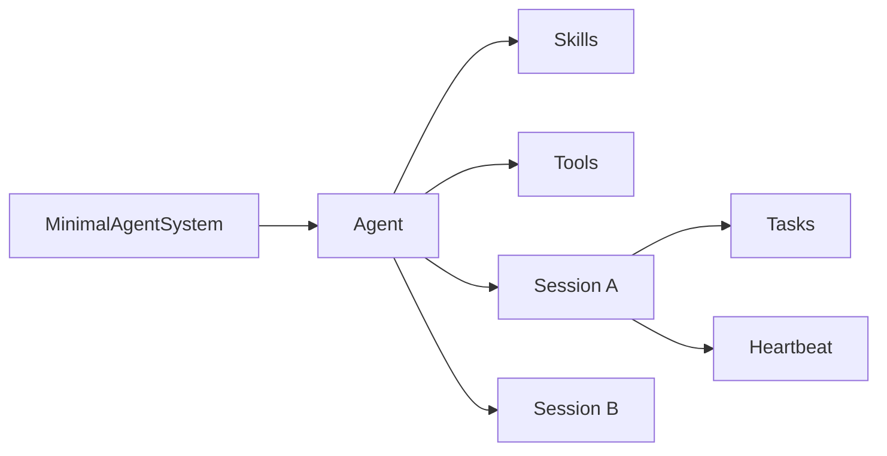

# OpenClaw 🦞

    
    

OpenClaw is a minimal agent runtime for building agents that can do work.

It is built around six things:

- agents
- skills
- tasks
- sessions
- tools
- heartbeat

Everything else is optional.

<Columns>
  <Card title="Minimal system" href="/concepts/minimal-system" icon="box">
    Start with the smallest product shape.
  </Card>
  <Card title="Session management" href="/concepts/session" icon="message-square">
    Give each agent one or more isolated conversations.
  </Card>
  <Card title="Heartbeat" href="/gateway/heartbeat" icon="heart">
    Run periodic follow-up turns without adding a larger scheduler.
  </Card>
</Columns>

## How it fits together

## Quick start

<Steps>
  <Step title="Create a system">
    Make one `MinimalAgentSystem`.
  </Step>
  <Step title="Create an agent">
    Give it a model, system prompt, and the tools it can use.
  </Step>
  <Step title="Load or register skills">
    Add one skill at a time or load `SKILL.md` files from disk.
  </Step>
  <Step title="Create sessions">
    Open one or more sessions per agent.
  </Step>
  <Step title="Run tasks and heartbeat">
    Send prompts into sessions and schedule periodic heartbeat turns.
  </Step>
</Steps>

## Read next

<Columns>
  <Card title="Minimal system guide" href="/concepts/minimal-system" icon="book-open">
    Programmatic setup and example code.
  </Card>
  <Card title="Skills" href="/tools/skills" icon="sparkles">
    Teach agents how to work.
  </Card>
  <Card title="Tools" href="/tools" icon="wrench">
    Give agents the capabilities they can execute.
  </Card>
  <Card title="Sessions" href="/concepts/session" icon="history">
    Persist isolated work across conversations.
  </Card>
</Columns>
